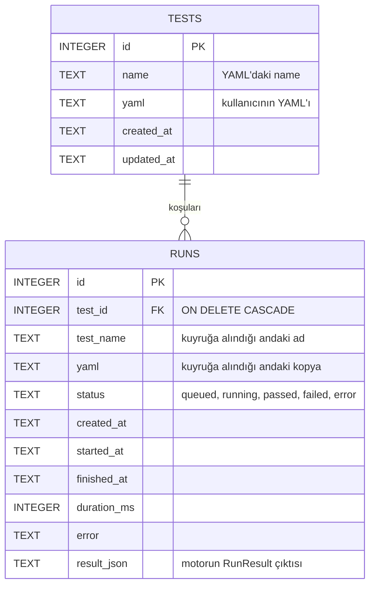
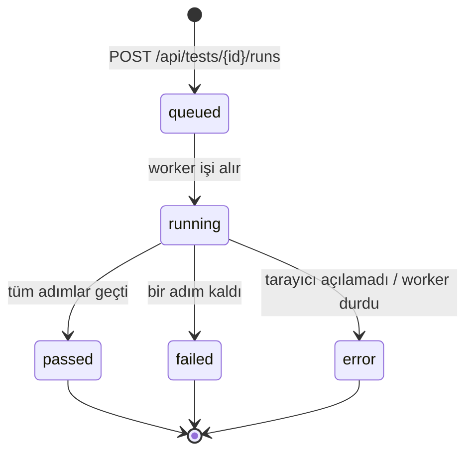

# Veritabanı (ER) Diyagramı

```mermaid
erDiagram
    TESTS ||--o{ RUNS : "koşuları"
    TESTS {
        INTEGER id PK
        TEXT name "YAML'daki name"
        TEXT yaml "kullanıcının YAML'ı"
        TEXT created_at
        TEXT updated_at
    }
    RUNS {
        INTEGER id PK
        INTEGER test_id FK "ON DELETE CASCADE"
        TEXT test_name "kuyruğa alındığı andaki ad"
        TEXT yaml "kuyruğa alındığı andaki kopya"
        TEXT status "queued, running, passed, failed, error"
        TEXT created_at
        TEXT started_at
        TEXT finished_at
        INTEGER duration_ms
        TEXT error
        TEXT result_json "motorun RunResult çıktısı"
    }
```

## Koşu durum makinesi

```mermaid
stateDiagram-v2
    [*] --> queued : POST /api/tests/{id}/runs
    queued --> running : worker işi alır
    running --> passed : tüm adımlar geçti
    running --> failed : bir adım kaldı
    running --> error : tarayıcı açılamadı / worker durdu
    passed --> [*]
    failed --> [*]
    error --> [*]
```
