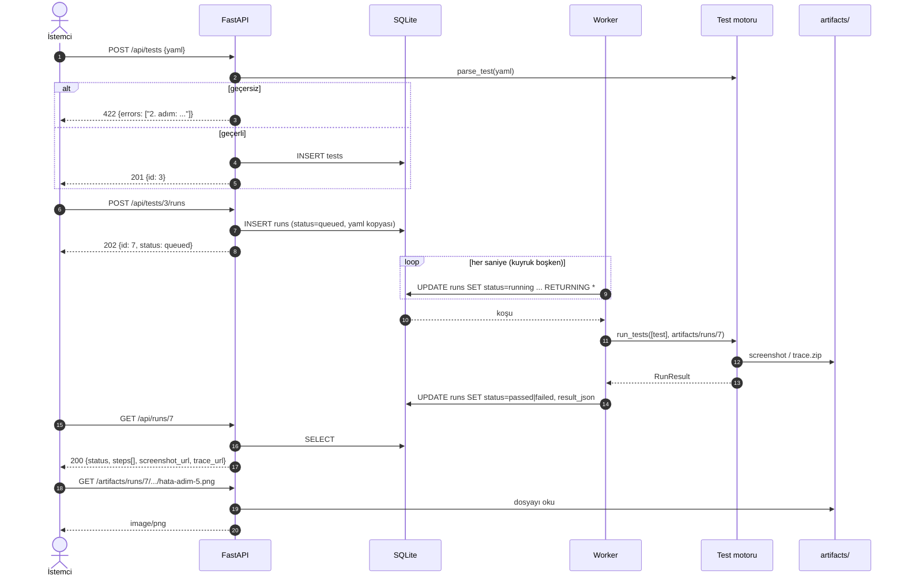

# "API Üzerinden Koşu" — Sequence Diyagramı

```mermaid
sequenceDiagram
    autonumber
    actor U as İstemci
    participant API as FastAPI
    participant DB as SQLite
    participant W as Worker
    participant E as Test motoru
    participant FS as artifacts/

    U->>API: POST /api/tests {yaml}
    API->>E: parse_test(yaml)
    alt geçersiz
        API-->>U: 422 {errors: ["2. adım: ..."]}
    else geçerli
        API->>DB: INSERT tests
        API-->>U: 201 {id: 3}
    end

    U->>API: POST /api/tests/3/runs
    API->>DB: INSERT runs (status=queued, yaml kopyası)
    API-->>U: 202 {id: 7, status: queued}

    loop her saniye (kuyruk boşken)
        W->>DB: UPDATE runs SET status=running ... RETURNING *
    end
    DB-->>W: koşu #7
    W->>E: run_tests([test], artifacts/runs/7)
    E->>FS: screenshot / trace.zip
    E-->>W: RunResult
    W->>DB: UPDATE runs SET status=passed|failed, result_json

    U->>API: GET /api/runs/7
    API->>DB: SELECT
    API-->>U: 200 {status, steps[], screenshot_url, trace_url}
    U->>API: GET /artifacts/runs/7/.../hata-adim-5.png
    API->>FS: dosyayı oku
    API-->>U: image/png
```
