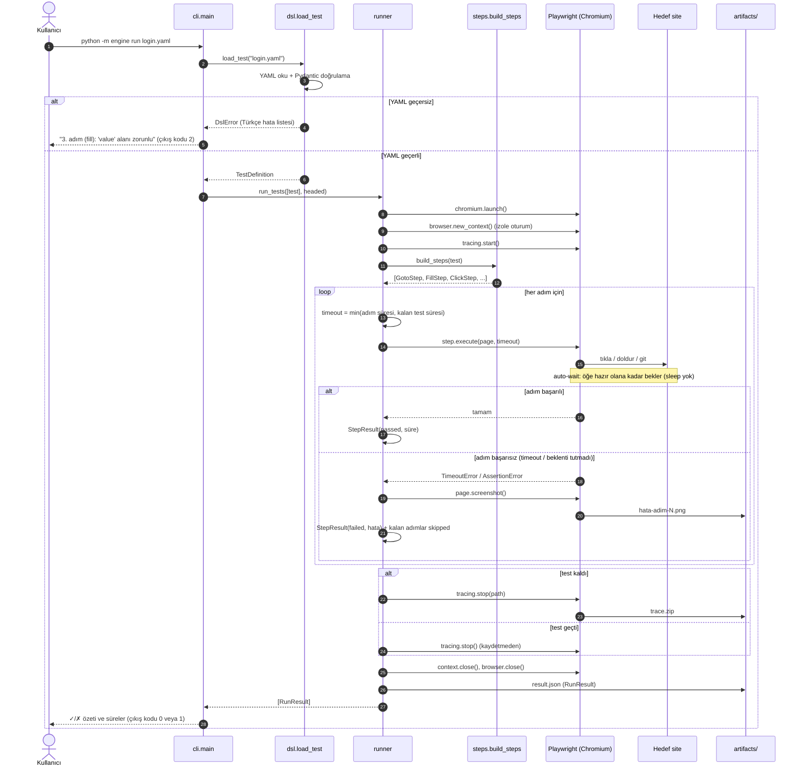

# "Bir Testin Koşturulması" — Sequence Diyagramı

Komut: `python -m engine run examples/login.yaml`

```mermaid
sequenceDiagram
    autonumber
    actor U as Kullanıcı
    participant CLI as cli.main
    participant DSL as dsl.load_test
    participant R as runner
    participant S as steps.build_steps
    participant PW as Playwright (Chromium)
    participant Site as Hedef site
    participant FS as artifacts/

    U->>CLI: python -m engine run login.yaml
    CLI->>DSL: load_test("login.yaml")
    DSL->>DSL: YAML oku + Pydantic doğrulama
    alt YAML geçersiz
        DSL-->>CLI: DslError (Türkçe hata listesi)
        CLI-->>U: "3. adım (fill): 'value' alanı zorunlu" (çıkış kodu 2)
    else YAML geçerli
        DSL-->>CLI: TestDefinition
        CLI->>R: run_tests([test], headed)
        R->>PW: chromium.launch()
        R->>PW: browser.new_context() (izole oturum)
        R->>PW: tracing.start()
        R->>S: build_steps(test)
        S-->>R: [GotoStep, FillStep, ClickStep, ...]

        loop her adım için
            R->>R: timeout = min(adım süresi, kalan test süresi)
            R->>PW: step.execute(page, timeout)
            PW->>Site: tıkla / doldur / git
            Note over PW,Site: auto-wait: öğe hazır olana kadar bekler (sleep yok)
            alt adım başarılı
                PW-->>R: tamam
                R->>R: StepResult(passed, süre)
            else adım başarısız (timeout / beklenti tutmadı)
                PW-->>R: TimeoutError / AssertionError
                R->>PW: page.screenshot()
                PW->>FS: hata-adim-N.png
                R->>R: StepResult(failed, hata) + kalan adımlar skipped
            end
        end

        alt test kaldı
            R->>PW: tracing.stop(path)
            PW->>FS: trace.zip
        else test geçti
            R->>PW: tracing.stop() (kaydetmeden)
        end
        R->>PW: context.close(), browser.close()
        R->>FS: result.json (RunResult)
        R-->>CLI: [RunResult]
        CLI-->>U: ✓/✗ özeti ve süreler (çıkış kodu 0 veya 1)
    end
```
